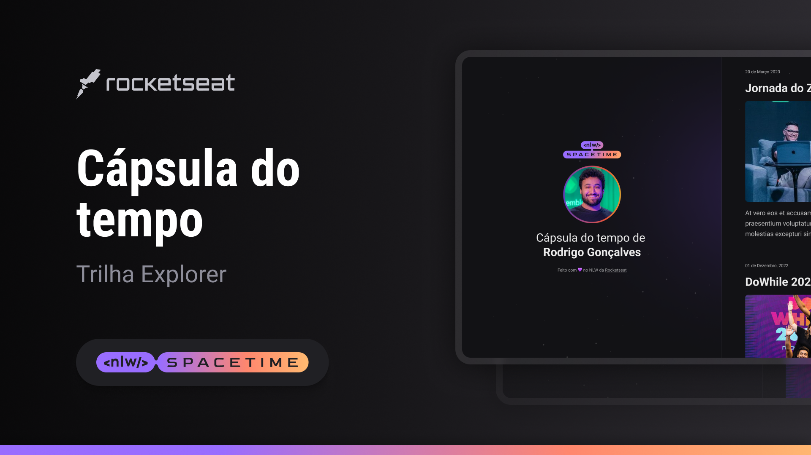

  

## 💻Projeto
Esse é um projeto WEB Responsivo de uma cápsula do tempo para exibir memorias em uma linha do tempo.

## 🚀Tecnologias
Esse projeto foi desenvolvido durante a NLW da Rocketseat com as seguintes tecnologias :

-HTML 
-CSS 
-Git e GitHub 
-Figma 

## 👀Layout
Você pode visualizar o layout do projeto atravéz
[Desse link](https://www.figma.com/file/kklRUwStgwORUQdZaUErRK/C%C3%A1psula-do-tempo-%E2%80%A2-Trilha-Explorer-(Community)-(Copy)?type=design&t=3UK8m6Oym97Agfz3-0).
É necessario ter uma conta no [Figma](https://www.figma.com)
